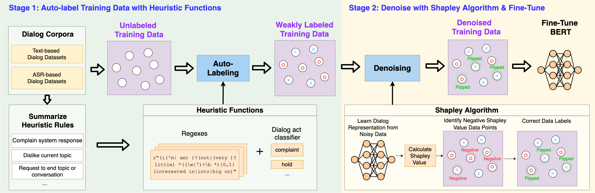
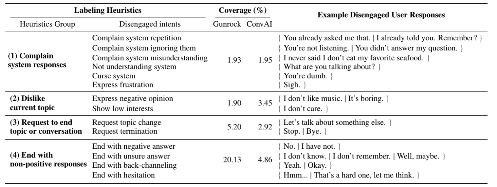
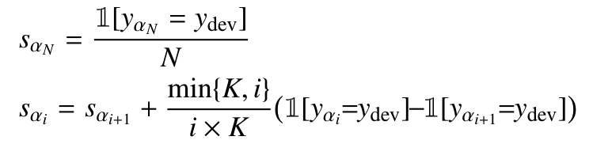

# HERALD: An Annotation Efficient Method to Train User Engagement Predictors in Dialogs

[](https://github.com/Weixin-Liang/HERALD/blob/master/LICENSE)

This repo provides the PyTorch source code of our paper: HERALD: An Annotation Efficient Method to Train User Engagement Predictors in Dialogs (ACL 2021).


```
@inproceedings{liang2021herald,
  author =  {Weixin Liang and Kai-Hui Liang and Zhou Yu},
  title =   {{HERALD:} An Annotation Efficient Method to Train User Engagement Predictors in Dialogs},
  year =    {2021},  
  booktitle = {{ACL}},
  publisher = {Association for Computational Linguistics}
}
```


## Abstract
*Open-domain dialog systems have a user-centric goal: to provide humans with an engaging conversation experience. User engagement is one of the most important metrics for evaluating open-domain dialog systems, and could also be used as real-time feedback to benefit dialog policy learning. Existing work on detecting user disengagement typically requires hand-labeling many dialog samples. 
We propose HERALD, an annotation efficient framework that reframes the training data annotation process as a denoising problem.
Specifically, instead of manually labeling training samples, we first use a set of labeling heuristics to automatically label training samples. We then denoise the weakly labeled data using Shapley algorithm. Finally, we use the denoised data to train a user engagement detector. 
Our experiments show that HERALD improves annotation efficiency significantly and 
achieves 86\% user disengagement detection accuracy in two dialog corpora.*


<p align='center'>
  
</p>


## Stage 1: Auto-label Training Data with Heuristic Functions
<p align='center'>
  
  <em>Table: Our labeling heuristics designed to capture user disengagement in dialogs.  A dialog turn is considereddisengaged if any of the heuristic rules applies to the user responses. </em>
</p>


## Stage 2: Denoise with Shapley Algorithm & Fine-tune

### Dependencies

Run the following commands to create a conda environment (assuming CUDA10.1):
```bash
conda create -n herald python=3.6
conda activate herald
conda install pytorch torchvision torchaudio cudatoolkit=10.2 -c pytorch
conda install matplotlib scipy
conda install -c conda-forge scikit-learn 
conda install -c conda-forge transformers
conda install pandas
```
Please check [shapley/requirements.txt](shapley/requirements.txt) or [shapley/requirements.yml](shapley/requirements.yml) for additional details about the dependencies (You don't need all of them). 

### BERT-based Dialog Classifier
Please check [shapley/bert_dialog_engagement_classifier.py](shapley/bert_dialog_engagement_classifier.py) and [shapley/data_utils.py](shapley/data_utils.py). The code is built upon the github repo [ABSA-PyTorch](https://github.com/songyouwei/ABSA-PyTorch). 
Many thanks to the authors and developers!

#### Training
```sh
python bert_dialog_engagement_classifier.py --model_name bert_spc
```
#### Running with Custom Dialog Dataset
Please check [shapley/convai_data/convai_dataloader.py](shapley/convai_data/convai_dataloader.py) for supporting custom dialog dataset. 

### Running the Data Shapley Algorithm
Shapley algorithm computes a Shapley value for each training datum, which quantifies the contribution of each training datum to the prediction and performance of a deep network. Low Shapley value data capture outliers and corruptions. 
Therefore, we can identify and denoise the incorrectly-labeled data by computing their Shapley values, and then fine-tune the model on cleaned training set. 

To obtain a closed-form solution of Shapley value, we extract the features of training data points and apply a K-nearest-neighbour classifier. The Shapley value of each training point can be calculated recursively as follows: 
<p align='center'>
  
</p>

Please check [shapley/shapley.py](shapley/shapley.py) for the implementation of the shapley algorithm. Note that you need to first extract the features for training datapoints before running the K-nearest-neighbour based Shapley algorithm. 


## Related Papers on Data Shapley
[Beyond User Self-Reported Likert Scale Ratings: A Comparison Model for Automatic Dialog Evaluation](https://www.aclweb.org/anthology/2020.acl-main.126/) (ACL 2020). Weixin Liang, James Zou and Zhou Yu. 

[Data Shapley: Equitable Data Valuation for Machine Learning. ](https://arxiv.org/abs/1904.02868) (ICML 2019). Amirata Ghorbani, James Zou. 
